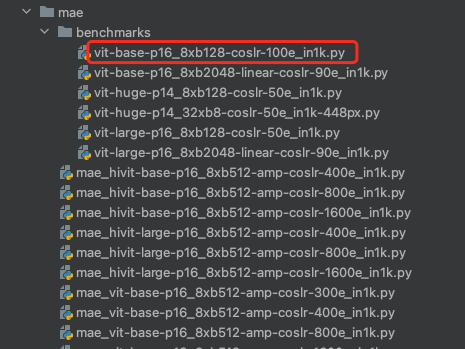

# 识别模型 加载 自监督权重

以MAE为例

1. `config/mae`的配置文件用于训练自监督算法，得到自监督权重。

   

2. `config/mae/benchmarks` 的配置文件用于下游识别任务，定义了识别模型。

   每个自监督算法均有对应的`benchmarks`文件夹。

3. 加载

```python
from mmpretrain import get_model
import torch
model = get_model("configs/mae/benchmarks/vit-base-p16_8xb128-coslr-100e_in1k.py", # 识别模型
                  pretrained="/xxx/mae_vit-base-p16_8xb512-fp16-coslr-1600e_in1k_20220825-f7569ca2.pth", # 自监督权重
                  head=dict(num_classes=2) # 修改模型输出类别数。（可选）
        )
x = torch.ones((1, 3, 224, 224))
y=model(x)
print(y)
```

- pretrained
  - True/False：加载官方预训练权重
  - 模型路径：加载指定权重

​		输出

```bash
mmengine - INFO - Because batch augmentations are enabled, the data preprocessor automatically enables the `to_onehot` option to generate one-hot format labels.
Loads checkpoint by local backend from path: /xxx/mae_vit-base-p16_8xb512-fp16-coslr-1600e_in1k_20220825-f7569ca2.pth
The model and loaded state dict do not match exactly

unexpected key in source state_dict: neck.mask_token, neck.decoder_pos_embed, neck.decoder_embed.weight, neck.decoder_embed.bias, neck.decoder_blocks.0.ln1.weight, neck.decoder_blocks.0.ln1.bias, neck.decoder_blocks.0.attn.qkv.weight, neck.decoder_blocks.0.attn.qkv.bias, neck.decoder_blocks.0.attn.proj.weight, neck.decoder_blocks.0.attn.proj.bias, neck.decoder_blocks.0.ln2.weight, neck.decoder_blocks.0.ln2.bias, neck.decoder_blocks.0.ffn.layers.0.0.weight, neck.decoder_blocks.0.ffn.layers.0.0.bias, neck.decoder_blocks.0.ffn.layers.1.weight, neck.decoder_blocks.0.ffn.layers.1.bias, neck.decoder_blocks.1.ln1.weight, neck.decoder_blocks.1.ln1.bias, neck.decoder_blocks.1.attn.qkv.weight, neck.decoder_blocks.1.attn.qkv.bias, neck.decoder_blocks.1.attn.proj.weight, neck.decoder_blocks.1.attn.proj.bias, neck.decoder_blocks.1.ln2.weight, neck.decoder_blocks.1.ln2.bias, neck.decoder_blocks.1.ffn.layers.0.0.weight, neck.decoder_blocks.1.ffn.layers.0.0.bias, neck.decoder_blocks.1.ffn.layers.1.weight, neck.decoder_blocks.1.ffn.layers.1.bias, neck.decoder_blocks.2.ln1.weight, neck.decoder_blocks.2.ln1.bias, neck.decoder_blocks.2.attn.qkv.weight, neck.decoder_blocks.2.attn.qkv.bias, neck.decoder_blocks.2.attn.proj.weight, neck.decoder_blocks.2.attn.proj.bias, neck.decoder_blocks.2.ln2.weight, neck.decoder_blocks.2.ln2.bias, neck.decoder_blocks.2.ffn.layers.0.0.weight, neck.decoder_blocks.2.ffn.layers.0.0.bias, neck.decoder_blocks.2.ffn.layers.1.weight, neck.decoder_blocks.2.ffn.layers.1.bias, neck.decoder_blocks.3.ln1.weight, neck.decoder_blocks.3.ln1.bias, neck.decoder_blocks.3.attn.qkv.weight, neck.decoder_blocks.3.attn.qkv.bias, neck.decoder_blocks.3.attn.proj.weight, neck.decoder_blocks.3.attn.proj.bias, neck.decoder_blocks.3.ln2.weight, neck.decoder_blocks.3.ln2.bias, neck.decoder_blocks.3.ffn.layers.0.0.weight, neck.decoder_blocks.3.ffn.layers.0.0.bias, neck.decoder_blocks.3.ffn.layers.1.weight, neck.decoder_blocks.3.ffn.layers.1.bias, neck.decoder_blocks.4.ln1.weight, neck.decoder_blocks.4.ln1.bias, neck.decoder_blocks.4.attn.qkv.weight, neck.decoder_blocks.4.attn.qkv.bias, neck.decoder_blocks.4.attn.proj.weight, neck.decoder_blocks.4.attn.proj.bias, neck.decoder_blocks.4.ln2.weight, neck.decoder_blocks.4.ln2.bias, neck.decoder_blocks.4.ffn.layers.0.0.weight, neck.decoder_blocks.4.ffn.layers.0.0.bias, neck.decoder_blocks.4.ffn.layers.1.weight, neck.decoder_blocks.4.ffn.layers.1.bias, neck.decoder_blocks.5.ln1.weight, neck.decoder_blocks.5.ln1.bias, neck.decoder_blocks.5.attn.qkv.weight, neck.decoder_blocks.5.attn.qkv.bias, neck.decoder_blocks.5.attn.proj.weight, neck.decoder_blocks.5.attn.proj.bias, neck.decoder_blocks.5.ln2.weight, neck.decoder_blocks.5.ln2.bias, neck.decoder_blocks.5.ffn.layers.0.0.weight, neck.decoder_blocks.5.ffn.layers.0.0.bias, neck.decoder_blocks.5.ffn.layers.1.weight, neck.decoder_blocks.5.ffn.layers.1.bias, neck.decoder_blocks.6.ln1.weight, neck.decoder_blocks.6.ln1.bias, neck.decoder_blocks.6.attn.qkv.weight, neck.decoder_blocks.6.attn.qkv.bias, neck.decoder_blocks.6.attn.proj.weight, neck.decoder_blocks.6.attn.proj.bias, neck.decoder_blocks.6.ln2.weight, neck.decoder_blocks.6.ln2.bias, neck.decoder_blocks.6.ffn.layers.0.0.weight, neck.decoder_blocks.6.ffn.layers.0.0.bias, neck.decoder_blocks.6.ffn.layers.1.weight, neck.decoder_blocks.6.ffn.layers.1.bias, neck.decoder_blocks.7.ln1.weight, neck.decoder_blocks.7.ln1.bias, neck.decoder_blocks.7.attn.qkv.weight, neck.decoder_blocks.7.attn.qkv.bias, neck.decoder_blocks.7.attn.proj.weight, neck.decoder_blocks.7.attn.proj.bias, neck.decoder_blocks.7.ln2.weight, neck.decoder_blocks.7.ln2.bias, neck.decoder_blocks.7.ffn.layers.0.0.weight, neck.decoder_blocks.7.ffn.layers.0.0.bias, neck.decoder_blocks.7.ffn.layers.1.weight, neck.decoder_blocks.7.ffn.layers.1.bias, neck.ln1.weight, neck.ln1.bias, neck.decoder_pred.weight, neck.decoder_pred.bias, data_preprocessor.mean, data_preprocessor.std, backbone.ln1.weight, backbone.ln1.bias

missing keys in source state_dict: backbone.ln2.weight, backbone.ln2.bias, head.fc.weight, head.fc.bias

tensor([[1.5115, 0.1408]], grad_fn=<AddmmBackward0>)
```

