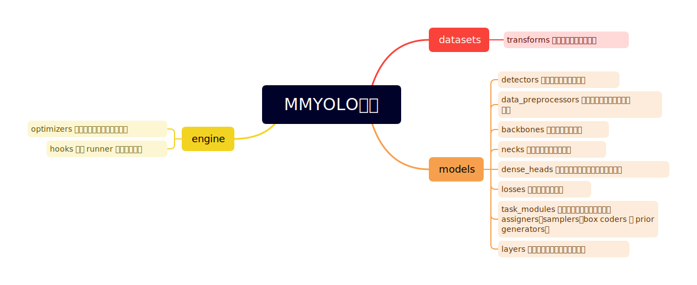

# OpenMM最佳食用手册

- 该仓库收录于[PytorchNetHub](https://github.com/bobo0810/PytorchNetHub)
- [荣誉证书 ](荣誉证书)


## MMPretrain
- `识别模型`加载`自监督预训练权重`   [教程](MMPretrain/load_weight.md) 
- 训练时加载`预训练权重`   [教程](MMPretrain/load_pre.md) 


## MMYOLO目标检测



------


<details>
<summary>以下内容已过时</summary>
## MMClassification图像识别


<center>整体框架图</center>

[配置文件-官方教程](https://mmclassification.readthedocs.io/zh_CN/dev-1.x/user_guides/config.html)

优势

- 模型库：支持内置库、timm、huggingface
- 任务：支持单任务、多任务、TTA测试等

用法

- 启用timm模型库

  ```python
  model = dict(
      _delete_=True,
      type="TimmClassifier",
      model_name="swinv2_base_window16_256",
      pretrained=True, # timm接口参数
      loss=xxx,
      train_cfg=xxx,
  )
  ```

- 命令行改参数

  ```bash
  bash ./tools/dist_train.sh  xx.py  --amp  --cfg-options train_dataloader.batch_size=12
  ```


## MMSelfSup自监督

- 比较两个图像的相似度   [代码](MMSelfSup/cos/cosine.py)
- 自定义数据集训练  [代码](MMSelfSup/custom_data/readme.md)
</details>


